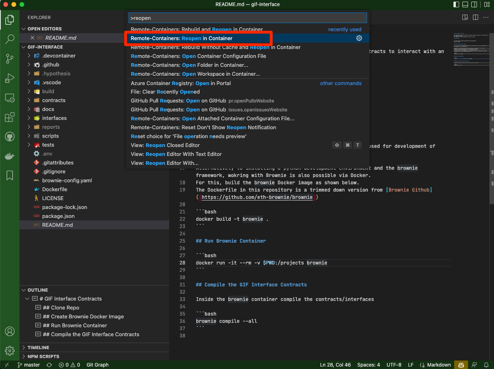
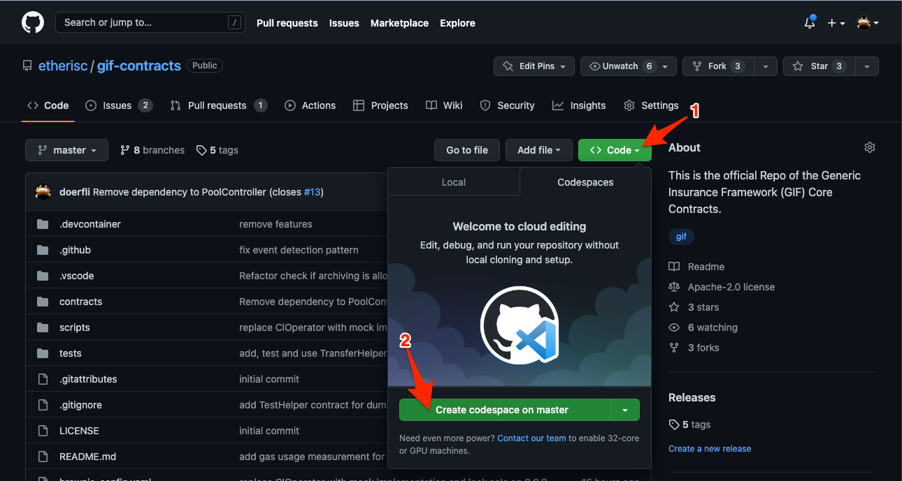

## Launch a preconfigured (local) development environment for `gif-contracts`

To start developing GIF contracts you can launch a fully preconfigured development container based on Microsoft Visual Studio Code with just a few clicks. 

The following instuctions currently work for the [gif-interface](https://github.com/etherisc/gif-interface) as well as the [gif-contracts](https://github.com/etherisc/gif-contracts) repository. 

### Locally on your machine

#### Prerequisites 

The following components must be installed on your machine

- [Visual Studio Code](https://code.visualstudio.com/) 
- Visual Studo Code Extension [Visual Studio Code Remote - Containers](https://marketplace.visualstudio.com/items?itemName=ms-vscode-remote.remote-containers) installed and activated 
- Container engine (e.g. [Docker](https://www.docker.com/), [Podman](https://podman.io/) or similar)

#### Instructions

- Checkout the repository for [gif-interface](https://github.com/etherisc/gif-interface) or [gif-contracts](https://github.com/etherisc/gif-contracts)
- Open the source in Visual Studio Code
- In some cases Visual Studio Code will detect the (so called) _devcontainer_  automatically and show a little pop-up window at the bottom right offering to reopen the project inside the development container automatically. 
- If this is not the case, then press `F1` and choose the option `Remote-Containers: Reopen in container`. This will build a new (fully configured) development container and reopen Visual Studio Code within that container. 
  
- _Please note_: building of the container can take some minutes as the container setup downloads and installs all required dependencies. 
- Once the contaner is up, you now have a fully configured IDE for GIF development at your hands. Happy coding!
- Join us on [Discord](https://discord.gg/cVsgakVG4R) if you have any questions. 

### Github Codespaces

If you have access to [Github Codespaces](https://github.com/codespaces) it gets even easiert. You can create a new codespace by browsing to one of the above repositories then then click on `Code` -> `Create codespace on master` and this will create and launch a fully configured IDE workspace for the repository. 

_Please note_: building of the codespace might take some minutes. Once it has been started it will restart within seconds. 

Once the contaner is up, you now have a fully configured IDE for GIF development at your hands. Happy coding!

Join us on [Discord](https://discord.gg/cVsgakVG4R) if you have any questions. 

