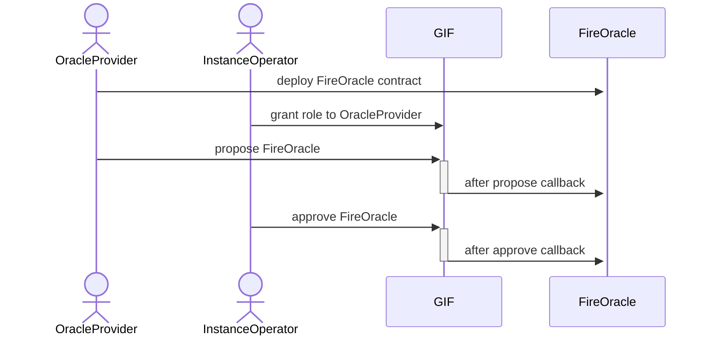

# Fire oracle registration

```mermaid
sequenceDiagram
    actor OP as OracleProvider
    actor IO as InstanceOperator
    participant G as GIF
    participant O as FireOracle
 
    
    OP->>+ O: deploy FireOracle contract
    IO ->> G: grant role to OracleProvider
    OP ->>+ G: propose FireOracle
    G ->>- O: after propose callback
    IO ->>+ G: approve FireOracle
    G ->>- O: after approve callback
```
