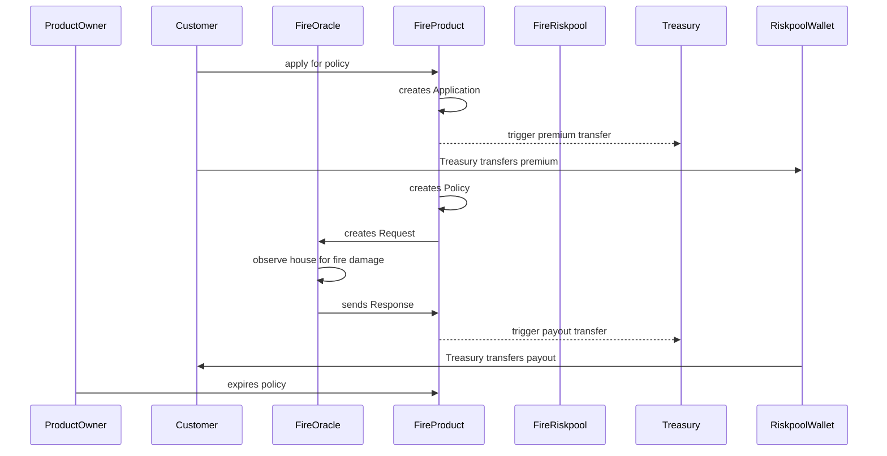

# Fire product lifecycle

```mermaid
sequenceDiagram
    participant PO as ProductOwner
    participant C as Customer
    participant O as FireOracle
    participant P as FireProduct
    participant R as FireRiskpool
    participant T as Treasury
    participant RW as RiskpoolWallet
    
    C ->> P: apply for policy
    P ->> P: creates Application
    P -->> T: trigger premium transfer
    C ->> RW: Treasury transfers premium
    P ->> P: creates Policy
    P ->> O: creates Request
    O ->> O: observe house for fire damage
    O ->> P: sends Response
    P -->> T: trigger payout transfer
    RW ->> C: Treasury transfers payout
    PO ->> P: expires policy
```