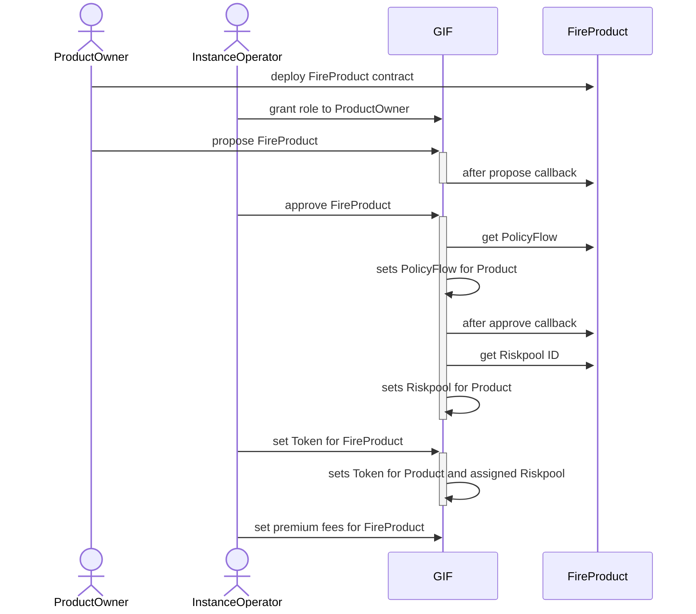

# Fire product registration

```mermaid
sequenceDiagram
    actor PO as ProductOwner
    actor IO as InstanceOperator
    participant G as GIF
    participant P as FireProduct
    
    PO ->>+ P: deploy FireProduct contract
    IO ->> G: grant role to ProductOwner
    PO ->>+ G: propose FireProduct
    G ->>- P: after propose callback
    IO ->>+ G: approve FireProduct
    G ->> P: get PolicyFlow
    G ->> G: sets PolicyFlow for Product
    G ->> P: after approve callback
    G ->> P: get Riskpool ID
    G ->>- G: sets Riskpool for Product
    IO ->>+ G: set Token for FireProduct
    G ->>- G: sets Token for Product and assigned Riskpool
    IO ->> G: set premium fees for FireProduct
```
