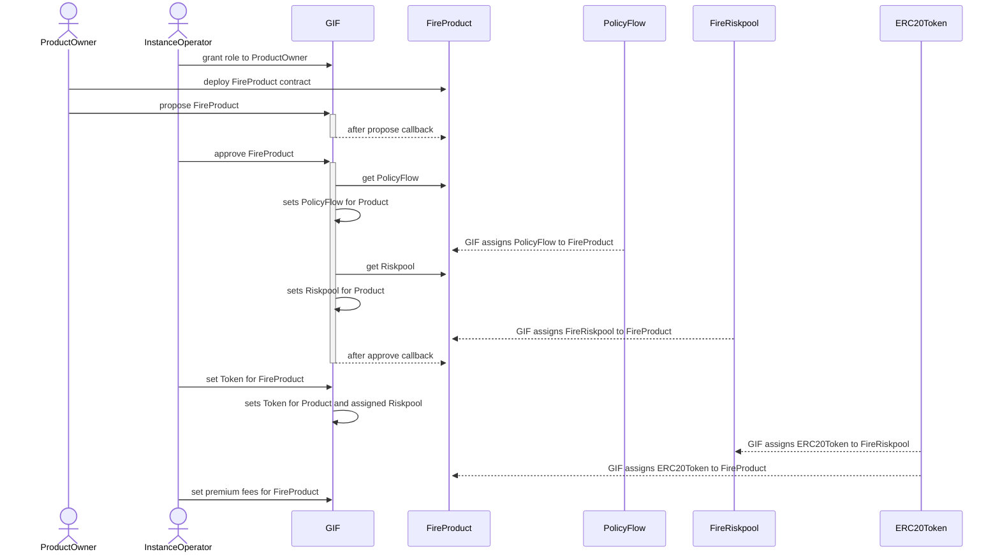

# Fire product registration

```mermaid
sequenceDiagram
    actor PO as ProductOwner
    actor IO as InstanceOperator
    participant G as GIF
    participant P as FireProduct
    participant F as PolicyFlow
    participant R as FireRiskpool
    participant T as ERC20Token
    
    IO ->> G: grant role to ProductOwner
    PO ->>+ P: deploy FireProduct contract
    PO ->>+ G: propose FireProduct
    G -->>- P: after propose callback
    IO ->>+ G: approve FireProduct
    G ->> P: get PolicyFlow
    G ->> G: sets PolicyFlow for Product 
    F -->> P: GIF assigns PolicyFlow to FireProduct 
    G ->> P: get Riskpool
    G ->> G: sets Riskpool for Product
    R -->> P: GIF assigns FireRiskpool to FireProduct
    G -->>- P: after approve callback
    IO ->> G: set Token for FireProduct
    G ->> G: sets Token for Product and assigned Riskpool
    T -->> R: GIF assigns ERC20Token to FireRiskpool
    T -->> P: GIF assigns ERC20Token to FireProduct
    IO ->> G: set premium fees for FireProduct
```