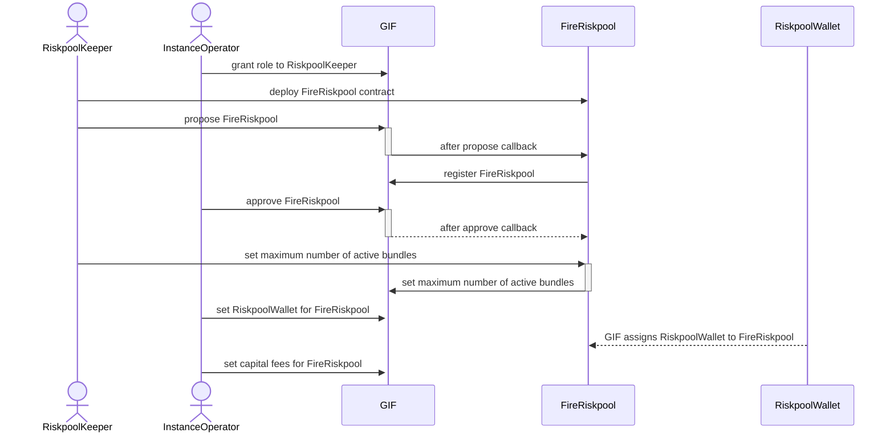

# Fire riskpool registration

```mermaid
sequenceDiagram
    actor RK as RiskpoolKeeper
    actor IO as InstanceOperator
    participant G as GIF
    participant R as FireRiskpool
    participant RW as RiskpoolWallet
    
    
    IO ->> G: grant role to RiskpoolKeeper
    RK ->> R: deploy FireRiskpool contract
    RK ->>+ G: propose FireRiskpool
    G ->>- R: after propose callback
    R ->> G: register FireRiskpool
    IO ->>+ G: approve FireRiskpool
    G -->>- R: after approve callback
    RK ->>+ R: set maximum number of active bundles
    R ->>- G: set maximum number of active bundles
    IO ->>+ G: set RiskpoolWallet for FireRiskpool
    RW -->> R: GIF assigns RiskpoolWallet to FireRiskpool 
    IO ->>+ G: set capital fees for FireRiskpool
```